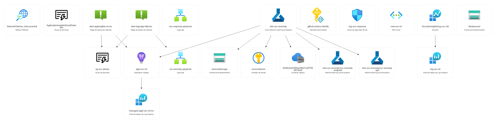

# Herramienta SOC con Machine Learning en Azure

Proyecto académico que implementa una herramienta de detección de anomalías de red para un Centro de Operaciones de Seguridad (SOC), integrando Machine Learning con Microsoft Azure y Sentinel.

## Descripción

El sistema analiza tráfico de red utilizando un modelo de Machine Learning entrenado sobre datos reales de red (dataset CIC-IDS2017 y capturas Wireshark), detectando patrones anómalos que podrían indicar actividad maliciosa. Cuando se detecta una anomalía, el sistema crea automáticamente un incidente en Microsoft Sentinel y bloquea la IP maliciosa en el firewall de red. La infraestructura completa está desplegada en Azure mediante Terraform.

## Arquitectura

```bash
Monitor local (Python · Isolation Forest)
↓ cada 60s
Azure Blob Storage (results.json)
↓ cada 30s
Dashboard web (Azure Static Website)
↓ botones de prueba
Logic App: soc-anomaly-playbook
↓
Azure ML Endpoint · Isolation Forest (inferencia)
↓
├── anomaly=false → log normal
└── anomaly=true  → Incidente Sentinel
+ Logic App: soc-response-playbook
↓
Bloqueo IP en NSG (automático)
```

## Arquitectura de Azure


## Demo

Dashboard en vivo: [https://stsocsmlstorage.z28.web.core.windows.net/](https://stsocsmlstorage.z28.web.core.windows.net/)

## Documentación por módulo

| Módulo | Descripción | Documentación |
|---|---|---|
| `frontend/` | Dashboard web de monitorización en tiempo real | [README →](./frontend/README.md) |
| `backend/` | Modelo Isolation Forest · entrenamiento e inferencia | [README →](./backend/README.md) |
| `infraestructura/` | Infraestructura Azure como código (Terraform) | [README →](./infraestructura/README.md) |

## Tecnologías

| Categoría | Tecnología |
|---|---|
| Cloud | Microsoft Azure (francecentral) |
| IaC | Terraform (azurerm ~> 4.0) |
| ML | Isolation Forest (scikit-learn) |
| Dataset | CIC-IDS2017 + capturas Wireshark (11 features) |
| Seguridad | Microsoft Sentinel · Azure Key Vault · NSG |
| Automatización | Azure Logic Apps (2 playbooks) |
| Monitorización | Azure Monitor · Application Insights · Azure Logs |
| Frontend | HTML/JS · Azure Static Website |
| CI/CD | GitHub Actions · OIDC (sin credenciales) |
| Testing | pytest · pre-commit hooks |
| Lenguaje | Python 3.11 |

## Estado del proyecto

- [x] Infraestructura base — RG, Log Analytics, Sentinel, VNet
- [x] Azure ML Workspace con dependencias
- [x] Entrenamiento Isolation Forest sobre datos reales de red
- [x] Monitor local con inferencia ML en tiempo real
- [x] Results subidos a Azure Blob Storage cada 60s
- [x] Secrets en Key Vault con Managed Identity
- [x] Logic App de detección (Sentinel ↔ ML ↔ Incidentes)
- [x] Playbook de respuesta automática (bloqueo IP en NSG)
- [x] Dashboard de monitorización (Azure Static Website)
- [x] CI/CD con GitHub Actions y autenticación OIDC
- [x] Azure Monitor con alertas métricas
- [x] Azure Logs con conectores de datos Sentinel
- [x] Tests unitarios (pytest · 18 tests)
- [x] Test de integración (pytest · 6 tests)
- [x] Pre-commit hooks (tests automáticos antes de cada commit)
- [x] Secret scanning (GitHub Advanced Security)

## Arrancar el monitor local

```bash
cd backend
python monitor.py
```

Requiere el archivo `backend/.env` con:
STORAGE_KEY=<clave del storage account>

## Ejecutar los tests

```bash
cd backend
pytest tests/ -v
```

> [!IMPORTANT]
## Nota IMPORTANTE sobre los GitHub Actions workflows

| Workflow | Trigger | Estado | Descripción |
|---|---|---|---|
| `Tests` | Push / PR | ✅ Automático | 24 tests unitarios e integración |
| `Terraform` | Push / PR | ✅ Automático | Validate + fmt del código IaC |
| `Terraform Apply` | Manual | ✅ Manual | Validate + instrucciones para deploy |
| `Terraform Destroy` | Manual | ✅ Manual | Validate + instrucciones para destroy |

Los workflows de **Apply** y **Destroy** validan el código Terraform y muestran las instrucciones necesarias para completar el despliegue. El paso de `terraform apply` contra Azure requiere ejecutarse desde local con `az login` porque la suscripción académica de EUNEIZ no permite crear App Registrations con credenciales OIDC para GitHub Actions.

Para completar la autenticación automática en un entorno sin restricciones:
1. Crear un App Registration en Azure AD con credencial federada para GitHub Actions
2. Añadir `AZURE_CLIENT_ID`, `ARM_TENANT_ID`, `ARM_SUBSCRIPTION_ID` como secrets del repositorio
3. Asignar rol **Contributor** al App Registration en la suscripción